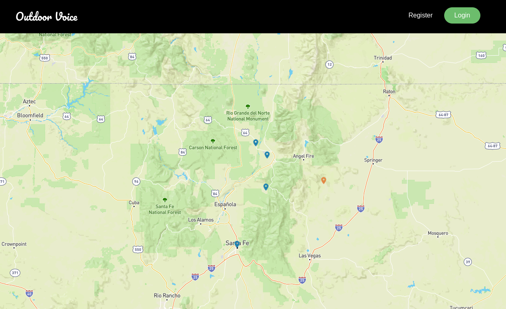

# Outdoor Voice

Outdoor Voice is a social mapping app that allows users to share and upload their experiences on a community map with people from around the world.

## Technologies Used

- JavaScript - Node - Express - React - MongoDb - JWT - Mapbox -

## Screenshots:

## Getting Started

To get started click [here](https://main--comforting-cucurucho-b43466.netlify.app/) and signup.

To view the project Trello board click [here](https://trello.com/invite/b/Hr2iWZoZ/a4e768bc26ffaa77d5273966efc852d0/project-management)

## Unsolved Problems

- Multiple posts can be opened at the same time
- Logout button needs to have cursor set to pointer on stylesheet
- Login and register modals can be opened at the same time
- Properly style the navigation bar
- Work on mobile view

## Future Enhancements

- Users can upload a picture with their posts
- Posts should cluster on the map when zoomed out
- Sidebar showing a scrollable list of all the posts in the map view
